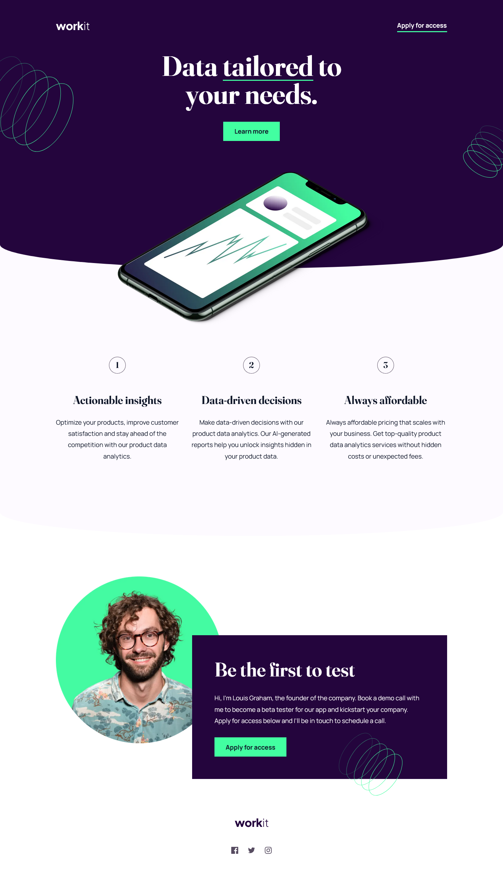

# Frontend Mentor - Workit Landing Page Solution

This is a solution to the [Workit Landing Page Challenge on Frontend Mentor](https://www.frontendmentor.io/challenges/workit-landing-page-2fYnyle5lu). Frontend Mentor challenges help you improve your coding skills by building realistic projects. 

## Table of contents

- [Overview](#overview)
  - [The Challenge](#the-challenge)
  - [Screenshots](#screenshots)
  - [Links](#links)
- [My Process](#my-process)
  - [Built With](#built-with)
  - [What I Learned](#what-i-learned)
  - [Continued Development](#continued-development)
- [Author](#author)

## Overview

### The Challenge

Users should be able to:

- View the optimal layout for the interface depending on their device's screen size
- See hover and focus states for all interactive elements on the page

### Screenshots




### Links

<!-- - Solution URL: [Frontend Mentor]() -->
- Live Site URL: [GitHub Pages](https://law973.github.io/workit-landing-page/)

## My Process

### Built With

- Semantic HTML
- CSS Flexbox
- Media queries
- SCSS
- SCSS extends and mixins
- CSS/SCSS variables
- Mobile-first workflow

### What I Learned

The curved ornamental borders for the hero and value sections, along with the hover/focus state of the primary button, made me learn more about the clip-path property. I also became more familiar with calc() when shaping the primary button's outline and positioning the background patterns.

Here's a snippet of CSS code I'm proud of:

```css
.button__primary {
  &:hover, &:focus {
    clip-path: polygon(
      -1px 0px, 
      0px -1px,
      100% -1px,
      calc(100% + 1px) 0px,
      calc(100% + 1px) 100%,
      100% calc(100% + 1px),
      0px calc(100% + 1px),
      -1px 100%
    );
  }
}
```

### Continued Development

I'd like to do more projects like this one, where element positions (such as relative and absolute) and the z-index property have to be kept in mind to display and interact with things correctly. I'd also like to continue learning about using clip-path to create shapes and using calc() for various purposes. 

## Author

- Website - [Levi Wright](https://leviwright.netlify.app/)
- Frontend Mentor - [@law973](https://www.frontendmentor.io/profile/law973)
- LinkedIn - [Levi Wright](https://www.linkedin.com/in/levi-arthur-wright/)
- GitHub - [@law973](https://github.com/law973)